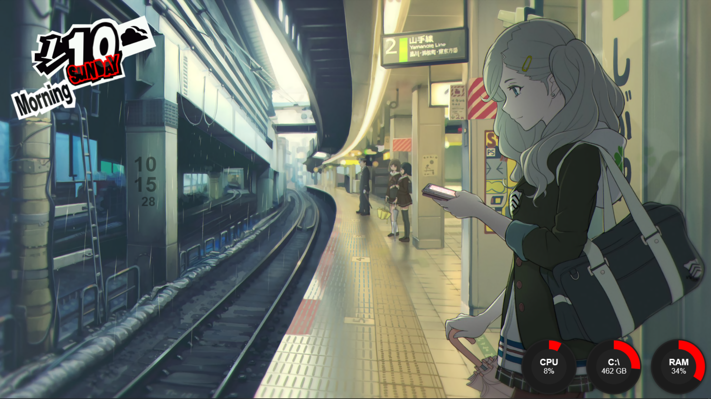

# Persona 5 Desktop: Ann Shibuya Station 
Latest version: WIP  

<h3>About</h3>

This is the repo for a fan-made, Persona 5-inspired Windows setup using Rainmeter. Cheers! 
* Included Rainmeter skins are either ones that I have coded or modified (see <a href= #credits>credits</a> below). 
* Best with 1920x1080 resolution, other sizes may vary in quality.

<td width="50%"></td>
<h3>Setup</h3> 

1. Install the latest version of Rainmeter here: https://www.rainmeter.net/.  
2. Visit OpenWeatherMap to find your weather location and API key here: https://openweathermap.org.
3. Make sure the following fonts are installed on your PC.  
a. "Arial" font family  
4. Visit the project release page and install the latest .rmskin files.
5. Add your weather location and API key into the P5R Calendar skin (see details here: https://www.deviantart.com/j3romey/art/P5R-Calendar-1-1-2-845538222)

<h3>Credits</h3>

* <a href= https://www.deviantart.com/j3romey/art/P5R-Calendar-1-1-2-845538222>Calendar Widget</a> — "P5R Calendar" by <a href= https://github.com/j3romey>j3romey</a>
* <a href= https://twitter.com/5114Ave/status/939811586151034881>Original Art (Wallpaper)</a> — "Ann Takamaki Waiting at Shibuya Station" by <a href= https://twitter.com/5114ave>@5114Ave </a>
* <a href= https://www.deviantart.com/cybergen49/art/CyberCircle-Suite-for-Rainmeter-815752935>System Information</a> — "CyberCircle Suite" by <a href= https://github.com/CyberGen49>CyberGen49</a>
* <a href= https://www.spriters-resource.com/playstation_3/persona5/>Various Persona 5 Sprites</a> — The Spriters Resource
* <a href= https://openweathermap.org>Weather API</a> — OpenWeatherMap
  
<h3>Brief Disclaimers</h3>
  
<i>In addition to the GNU General Public License v2.0 regarding the Rainmeter code, all skins are under the Creative Commons <a href= https://creativecommons.org/licenses/by-nc-sa/3.0/>BY-NC-SA 3.0</a> license. Sprites are ©Atlas, this setup is considered a fanart project and is for non-commercial purposes.</i>
